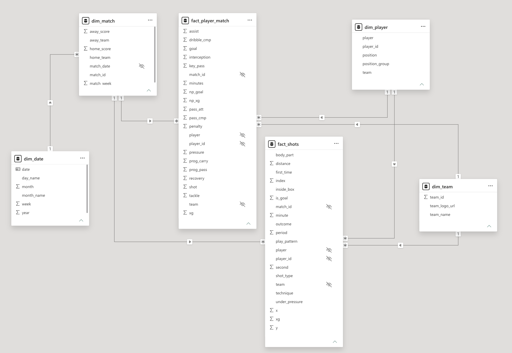
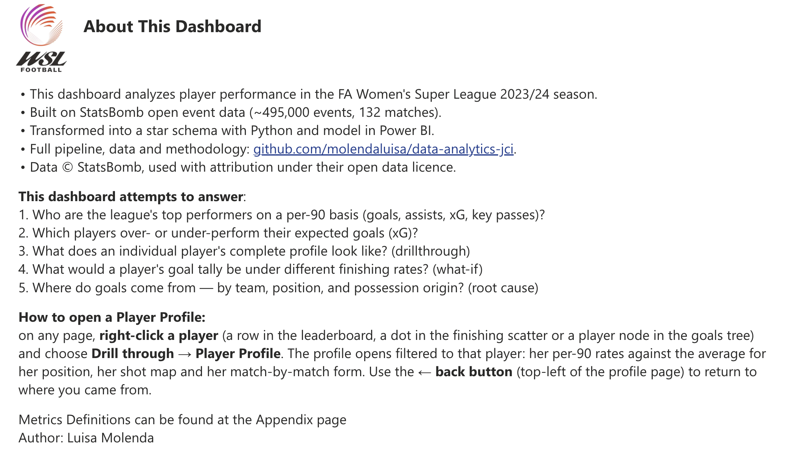
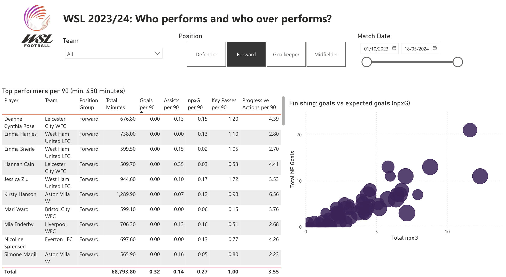
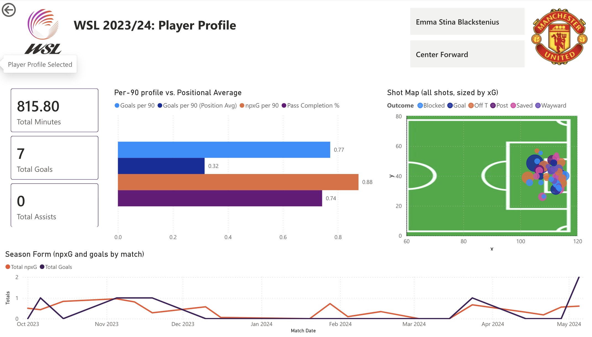
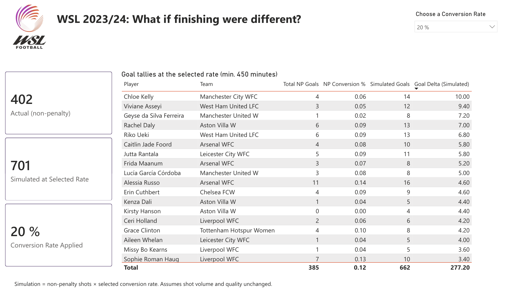
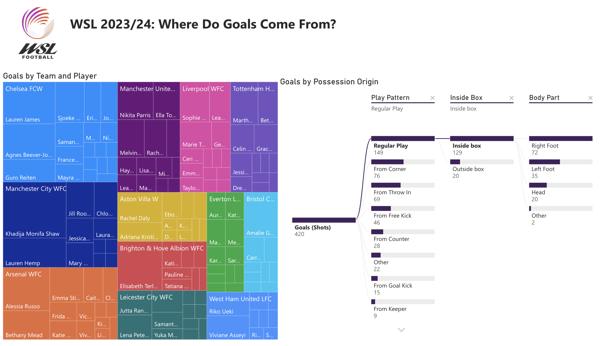
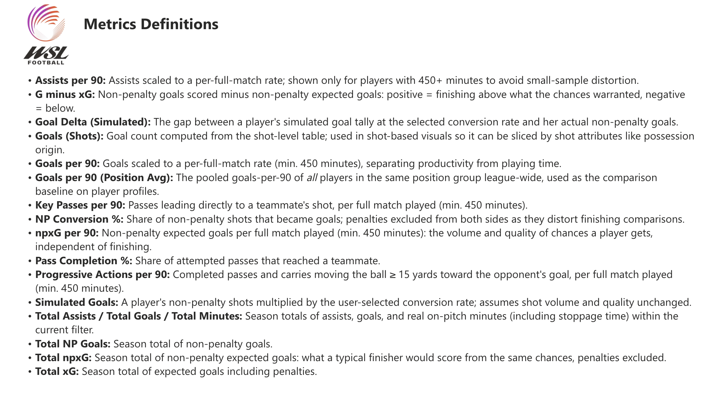

# data-analytics-jci
Repo for assignments on Data Analytics course from Johan Cruyff Institute.

## Assignment #3: GPS Athlete Training Session Analysis

Analysis of a single football training session recorded with a 10 Hz GPS tracker and a heart rate monitor. The goal is to turn raw tracking data into a clear, coach-facing picture of workload, movement and fatigue.

### What The Analysis Covers

- Data validation and cleaning (missing values, timestamp parsing, gap detection, speed cross-check)
- Transformations: speed in m/s, distance, acceleration, speed zones, sprint detection, heart rate zones
- Session split into two halves and 15-minute blocks to facilitate analysis
- Fatigue analysis using an efficiency index (distance per heartbeat)
- Five images: session overview, movement map, occupancy heatmap, intensity profile, and a per-block fatigue panel

The full write-up for the coach is in `report/` (PDF).

### Project Structure

    data/        raw data (not tracked in git — see below)
    notebooks/   analysis.ipynb (the full analysis)
    images/      images exported by the notebook
    report/      final PDF report

### Setup

Requires Python 3.11

```bash
# clone
git clone https://github.com/molendaluisa/data-analytics-jci.git
cd data-analytics-jci

# create and activate a virtual environment
python -m venv .venv
source .venv/bin/activate        # on Windows: .venv\Scripts\activate

# install dependencies
pip install -r requirements.txt
```

### Data

The raw data file is **not included** in this repository (large file size).
To run the notebook, place the data file in `data/` and name it `raw_data.csv`. Optionally, you can always modify the path in the 1st notebook cell to point to where you file is. The dataset is also available at [[Data Analytics in Sports JCI] Assignment #3](https://drive.google.com/drive/folders/1UOdxvXjD4mikWyyH5Nra7soX9SJsscHk?usp=drive_link).

### Running

Open `notebooks/analysis.ipynb` in VS Code or Jupyter, select the `.venv` kernel and run all cells from top to bottom. Figures are saved to `images/`.

### Notes & Assumptions

- The sport and athlete details are unknown. Football is assumed based on the field dimensions (118 × 72 m). Given in the original spreadsheet.
- Heart rate zones use the session maximum (189 bpm) as a proxy, since the true maximum is unknown.
- See the report appendix for full method details and limitations.

## Assignment #5: WSL 2023/2024 Performance Stats Dashboard

A player-level performance analysis of the FA Women's Super League 202324 season, built from StatsBomb open event data and visualized in Power BI.

### What This Project Does

Raw match event data (~495,000 events across 132 matches) is transformed with Python into a star schema, which powers an interactive Power BI dashboard answering five questions:

1. Who are the league's top performers on a per-90 basis (goals, assists, xG, key passes)?
2. Which players over- or under-perform their expected goals (xG)?
3. What does an individual player's complete profile look like? (drillthrough)
4. What would a player's goal tally be under different finishing rates? (what-if)
5. Where do goals come from — by team, position, and possession origin? (root cause)

### Data Source & Attribution

Event and lineup data: **[StatsBomb / Hudl StatsBomb Open Data](https://github.com/statsbomb/open-data)** — FA Women's Super League, 2023/24 season (competition_id 37, season_id 281).
Data is used under the StatsBomb open data licence, which requires attribution.

### Project Structure

    scripts/
        ├── 01_get_matches.py   pull competition + WSL 2023/24 match list
        ├── 02_get_events.py    download & cache events + lineups (resumable)
        ├── 03_validate.py      validate pipeline vs. official Golden Boot
        ├── 04_minutes.py       derive minutes played (interval-union method)
        ├── 05_aggregate.py     build player-match fact table
        ├── 06_dimensions.py    build dimension tables (player/team/match/date)
        └── 07_shots.py         build shot-level table for shot maps    
    models/     star schema CSVs consumed by Power BI
    cache/      raw event/lineup downloads (not versioned)
    dashboard/  PBI dashboard pbix file, pdf version also added

### Setup

Requires Python 3.11

```bash
# clone
git clone https://github.com/molendaluisa/data-analytics-jci.git
cd data-analytics-jci

# create and activate a virtual environment
python -m venv .venv
source .venv/bin/activate        # on Windows: .venv\Scripts\activate

# install dependencies
pip install -r requirements.txt
```

### Data

The raw data files are **not included** in this repository (large file size), however you can obtain them by running scripts `01_get_matches.py` and `02_get_events.py`

### Data Modeling

Star schema with two fact tables sharing conformed dimensions:

- `fact_player_match` — one row per player per match (3,979 rows): goals, np_xG, passing, progressive actions, defensive counts, minutes played
- `fact_shots` — one row per shot (3,529 rows): coordinates, xG, outcome, body part, possession origin
- Dimensions: `dim_player` (296 rows), `dim_team` (12 rows), `dim_match` (132 rows), `dim_date` (231 rows)

    •° `dim_match[match_date]` <— `dim_date[date]`

    •° `fact_player_match[match_id]` <— `dim_match[match_id]`

    •° `fact_player_match[player_id]` <— `dim_player[player _id]`

    •° `fact_player_match[team]` <— `dim_team[team_name]`

    •° `fact_shots[match_id]` <— `dim_match[match_id]`

    •° `fact_shots[player_id]` <— `dim_player[player_id]`

    •° `fact_shots[team]` <- `dim_team[team_name]`



### Notes & Assumptions

- **Validation:** total goals (420) were conserved across all three derived artifacts and the pipeline's top scorer (Khadija Shaw, 21 goals) matches the official 2023/24 Golden Boot.
- **Minutes played** are real on-pitch minutes including stoppage time, derived from lineup stints via interval union (robust to overlapping position records). Per-90 figures therefore read slightly lower than sources using the 90-minute convention (e.g. FBref).
- **Progressive pass/carry:** a completed action moving the ball ≥ 15 units closer to the opponent's goal line. Definitions vary across providers; this one was chosen for simplicity and transparency.
- **`play_pattern`** describes how the possession *started* (e.g. "From Throw In"), not the immediate assist type, visuals label it "possession origin" accordingly.
- **Known limitations:** no tracking/physical data; defensive counts are not possession-adjusted; "primary position" flattens positional versatility.

### Dashboard

Built in Power BI. pbix and pdf files can be found in `assignment_5/dashboard`. Unfortunately I don;t hold the licenses to publish the dashboard online for the public. Therefore, please download the pbix file or enjoy some screnshoots below:






